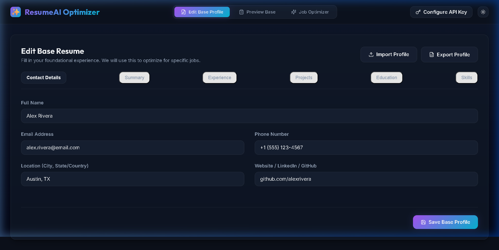
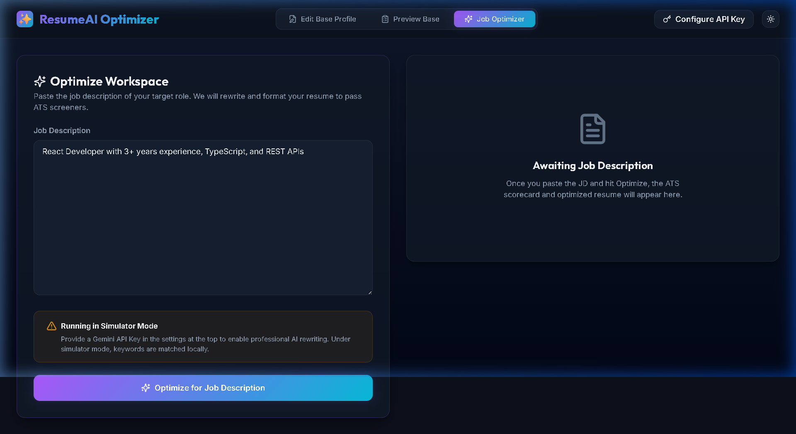

# ✨ ResumeAI Optimizer - ATS-Ready Tailored Resumes

An elegant, client-side React application powered by Gemini AI to dynamically optimize your resume for any target job description. Boost your ATS (Applicant Tracking System) match score instantly.

🖥️ **Live Web Demo**: [https://resume-optimizer-wine.vercel.app](https://resume-optimizer-wine.vercel.app)

---

## 📸 Screenshots

### 1. Interactive Master Resume Builder
Manage and edit all your experience, projects, skills, and education sections in a single sleek dashboard. Easily export/import your base profile.



### 2. AI Optimization Workspace
Paste any target Job Description (JD) to analyze and generate optimized sections with matching keywords, action verbs, and an ATS score gauge.



---

## 🚀 Key Features

* **⚡ Gemini AI Optimization**: Rewrite bullet points and summary statements utilizing target keywords while preserving your real experience.
* **📊 ATS Scoring & Feedback**: Instantly inspect matched/missing keywords and get actionable tips to optimize your rating.
* **🖨️ Clean Export (ATS-Friendly)**: Prints perfectly into an ATS-friendly, single-column, standard-compliant PDF layout using native printing styles.
* **🔒 Privacy First**: Your base data and API keys are stored securely client-side in browser `localStorage`.
* **🎨 Premium UI/UX**: Includes dark/light mode toggle, dynamic interactive diff comparison view, and loading scanning animations.

---

## 🛠️ Tech Stack

* **Core Framework**: React 18 & TypeScript
* **Build System**: Vite
* **Styling**: Vanilla CSS (Premium design tokens, custom glassmorphism)
* **AI Engine**: Gemini 2.5 Flash API (Client-side)
* **Icons**: Lucide React

---

## 🚀 Getting Started Locally

### Prerequisites
Make sure you have **Node.js** installed on your system.

### Installation
1. Clone this repository or open the project folder.
2. Open terminal in the directory and run:
   ```bash
   npm install
   ```
3. Start the local server:
   ```bash
   npm run dev
   ```
4. Open [http://localhost:3000](http://localhost:3000) in your browser.

---
## 💡 How it works with Gemini API

1. Go to the header and click **Configure API Key**.
2. Enter your Gemini API Key (get one free at Google AI Studio).
3. The optimizer sends your structured resume data alongside the target Job Description to the Gemini API, asking for targeted keyword rewrite while maintaining structural integrity.
4. If no API key is configured, the application falls back to a **local keyword-matching simulator engine** so you can preview features instantly.
